  

  

# 💫 About Me

🎓 Bachelor of Engineering (Computer Science & Technology)

💻 Passionate about Full Stack Development, Python, AI, and Backend Engineering

🚀 Building scalable software using MERN Stack, Django REST Framework, and Machine Learning

🌱 Currently learning
- System Design
- Machine Learning
- Advanced MERN
- Cloud Fundamentals

🎯 Looking for
- Software Engineering Internships
- Python Developer Roles
- MERN Stack Developer Roles

# 🚀 Featured Projects

## 💰 WealthNest
### AI-Powered Family Investment Portfolio Tracker

**React • Node • Express • Django REST • MongoDB • Gemini AI • Scikit-learn**

**[Live Demo →](https://wealthnest-client.onrender.com)**

✔ Machine Learning Risk Prediction

✔ AI Chatbot

✔ Portfolio Analytics

✔ PDF Reports

✔ Role-Based Authentication

---

## 📊 SpendWise

Expense Tracker System

Python • Streamlit • Pandas • JavaScript

✔ Budget Monitoring

✔ Borrow/Lend Tracking

✔ Expense Analytics

✔ Interactive Charts

---

## 💼 CareeRise

Java Job Portal

Java • JDBC • MySQL

✔ Resume Parsing

✔ Smart Job Matching

✔ Custom Queue

✔ Stored Procedures

---

## 💼 Payroll Management System

Core Java

✔ Salary Calculation

✔ Employee Management

✔ OOP Concepts

---

## 🛒 SmartCart

Core Java

✔ Inventory Management

✔ Billing System

✔ Payment Processing

# 💻 Tech Stack

### Languages

### Frontend

### Backend

### Database

### Tools

Git • GitHub • VS Code • Streamlit • Pandas

# 📊 GitHub Stats

  
  

---

# 🔥 GitHub Streak

---

# 🏆 GitHub Trophies

---

# 📈 Contribution Graph

Self-hosted SVG (no third-party badge service, so it can't 402 on you) — regenerated
daily from your real public contributions by <code>.github/workflows/update-profile-art.yml</code>.
Commit <code>contrib-heatmap.svg</code>, <code>scripts/</code>, and <code>data/</code> from the earlier
download for this to render.

---

# 🐍 Contribution Snake

<!--
  Note: this only renders if you have the snake-generation GitHub Action
  set up in your ShreeyaBhatt/ShreeyaBhatt profile repo, committing the
  SVG to an "output" branch. If you haven't added that workflow yet,
  see: https://github.com/Platane/snk
-->

# 🌐 Connect With Me

---

# ⚡ Fun Fact

🎤 I enjoy singing just as much as I enjoy building software.

💡 I believe technology should solve real-world problems.

⭐ Thanks for visiting my profile!

  

